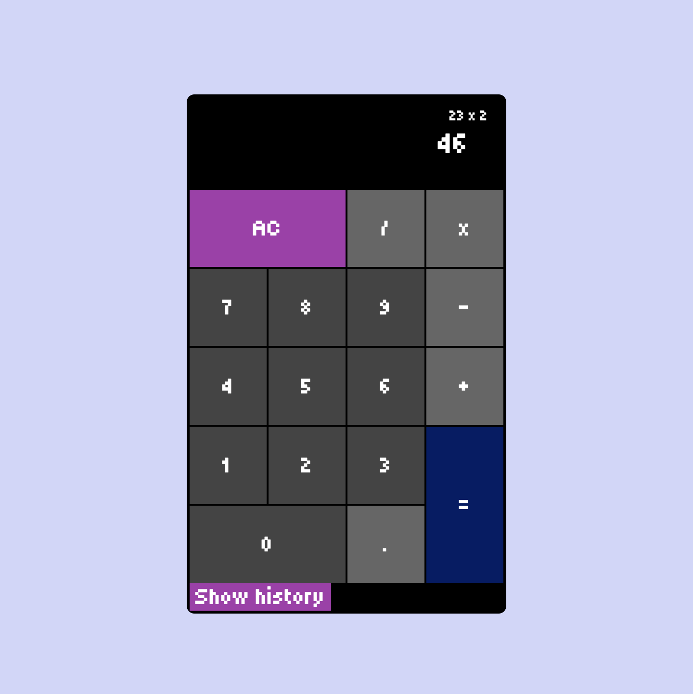

# Calculator

A simple calculator built with **HTML, CSS, and JavaScript**.  
Supports basic arithmetic operations with a clean and responsive UI.

---

## Preview

---

## Features

- Basic operations: addition, subtraction, multiplication, division
- Dynamic input handling
- Clear (AC) functionality
- Responsive layout

---

## Tech Stack

- HTML
- CSS
- JavaScript

---

## Goal

Practice DOM manipulation, event handling, and building interactive UI components.

---

## Live Demo

https://your-link-here.com
